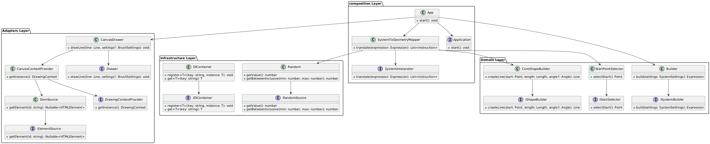

<h1 align="center">Lindenmayer-System in Clean Architecture</h1>
<p align="center">
  <em>The L-system (Lindenmayer system) is a formal grammar used to model the processes of growth and development of biological organisms, as well as to generate complex structures and fractals. It consists of an alphabet of symbols, an axiom (initial state), and a set of rewriting rules that determine how each symbol is transformed into a sequence of other symbols at each iteration step. L-systems are parallel rewriting systems where all characters are processed simultaneously, which allows efficient modeling of branching and recursive structures. It is allowed and implemented in this project.</em>
</p>

[Дока на русском](./docs/README.ru.md)

__When implementing the project, I used materials from <a href="https://bespoyasov.ru/blog/generating-trees-on-canvas-using-typescript-and-oop/">of this article</a>. The author in the project used additional libraries for dependency management, in my case I implemented part of the library myself in the project. I also added a structure that I think is more suitable for a Clean architecture and a more pleasant UI.__

## Project structure

- ```src/``` — project source files
- ```src/adapters``` — the application adapter layer
- ```src/application``` — the application layer
- ```src/domain``` — the domain layer
- ```src/infrastructure``` - the infrastructure layer
- ```src/presentation``` - the presentation layer
- ```src/types``` - project test files
- ```src/composition``` — launching the app

## Important files

- ```src/composition``` — the di container elements are added here, and the application is launched
- ```src/composition/launching-app``` — the module of the main instances of the application
- ```src/infrastructure/DI-container``` — the source files of the DI container. It is needed in order to implement dependency management in the project
- ```src/infrastructure/app-settings``` — application settings
- ```src/infrastructure/structural-settings``` — The structural settings of the application are needed in order to describe the meta data of the project modules (used in the DI container)
- ```src/interpreter``` — the L-system creation module

## Installation and launch

To install and run the project, run the following commands

**Cloning the slokaln repository project**
```Bash
git clone https://github.com/DKMFzF/Lindenmayer-System-in-Clean-Architecture.git
```

**Going to the project directory**
```Bash
cd Lindenmayer-System-in-Clean-Architecture
```

**Locking up third-party libraries**
```Bash
npm install
npm run start
```

or

```Bash
yarn
yarn start
```

## Assembly

```
npm run build
```

or

```
yarn build
```

## Application Architecture (Clean Architecture)
Clean Architecture is an approach to software design proposed by Robert Martin (Uncle Bob), which aims to create flexible, scalable, and easily maintainable systems. The basic idea is to divide the system into layers with clearly defined responsibilities and dependencies in order to minimize connectivity between components and ensure independence from external factors such as frameworks, databases or user interfaces.

A pure architecture organizes a system in the form of concentric layers, where the outer layers (for example, UI or database) depend on the inner ones (business logic), but not vice versa. This is achieved through the use of abstractions and Dependency Inversion Principle, which makes the system more resilient to change and simplifies its development.

#### The detailed diagram of the project is small


## Useful links
- [What are L-systems?](https://habr.com/ru/articles/540062/)
- [The Mathematical Beauty of Computing](https://habr.com/ru/articles/69989/)
- [Lindenmayer Systems](https://www.maplesoft.com/support/help/maple/view.aspx?path=MathApps/LindenmayerSystems)
- [Lindenmayer Systems article 2](https://jobtalle.com/lindenmayer_systems.html)
- [A guy creates an L-System in Python](https://www.youtube.com/watch?v=mAz46Z5curo)
- [Three-layer architecture](https://doka.guide/tools/clean-architecture/)
- [Clean Architecture](https://habr.com/ru/companies/otus/articles/732178/)
- [Basics of dependency injection](https://habr.com/ru/articles/434380/)
- [DI in TypeScript](https://bespoyasov.ru/blog/di-ts-in-practice/)
- [SOLID principles that every developer should know about](https://habr.com/ru/companies/ruvds/articles/426413/)
- [Another site where there is a lot about SOLID](https://solidbook.vercel.app/)
- [Article: "DDD, Hexagonal, Onion, Clean, CQRS, … How I put it all together"](https://herbertograca.com/2017/11/16/explicit-architecture-01-ddd-hexagonal-onion-clean-cqrs-how-i-put-it-all-together/)
- [The author of the articles from which he took the code and clarified the L-Systems for himself. Thanks for the explanation!](https://github.com/bespoyasov)
- [The first article of the project](https://bespoyasov.ru/blog/generating-trees-on-canvas-using-typescript-and-oop/)
- [The second article of the project](https://bespoyasov.ru/blog/generating-trees-on-canvas-using-typescript-and-oop-2/)
- [The third article of the project](https://bespoyasov.ru/blog/generating-trees-on-canvas-using-typescript-and-oop-3/)
- [Original project on GitHub](https://github.com/bespoyasov/treees)
